# Documento Técnico — MathMaster

**Versión:** 2.0.0
**Fecha:** Marzo 2026
**Tipo de sistema:** Plataforma educativa gamificada de matemáticas

---

## Tabla de Contenidos

1. [Visión General del Sistema](#1-visión-general-del-sistema)
2. [Stack Tecnológico](#2-stack-tecnológico)
3. [Arquitectura del Sistema](#3-arquitectura-del-sistema)
4. [Estructura del Proyecto](#4-estructura-del-proyecto)
5. [Base de Datos — Modelo de Datos](#5-base-de-datos--modelo-de-datos)
6. [Backend — API FastAPI](#6-backend--api-fastapi)
7. [Frontend — React](#7-frontend--react)
8. [Sistema de Autenticación y Roles](#8-sistema-de-autenticación-y-roles)
9. [Lógica de Negocio Principal](#9-lógica-de-negocio-principal)
10. [Infraestructura y Despliegue](#10-infraestructura-y-despliegue)
11. [Variables de Entorno](#11-variables-de-entorno)
12. [Credenciales por Defecto](#12-credenciales-por-defecto)
13. [Flujos Principales del Sistema](#13-flujos-principales-del-sistema)

---

## 1. Visión General del Sistema

**MathMaster** es una plataforma educativa gamificada diseñada para la enseñanza de matemáticas en entornos escolares. El sistema permite a profesores gestionar clases (paralelos), asignar metas y competencias, mientras que los estudiantes practican matemáticas a través de un sistema de juego con puntos, insignias y rankings.

### Roles del sistema

| Rol | Descripción |
|-----|-------------|
| **Admin** | Gestiona usuarios, paralelos, configuración global del sistema |
| **Profesor (Teacher)** | Crea ejercicios, metas, competencias, ve el progreso de sus estudiantes |
| **Estudiante (Student)** | Juega ejercicios, ve su progreso, participa en competencias |

### Características clave

- Ejercicios matemáticos generados dinámicamente y adaptativos por dificultad
- Sistema de puntuación con bonificaciones y penalizaciones
- Insignias (badges) por logros
- Competencias (Versus) entre paralelos
- Metas educativas asignables por el profesor
- Ranking de estudiantes
- Recursos educativos (PDFs, videos, links)
- Reportes en PDF generados desde el backend
- Recuperación de contraseña por correo electrónico

---

## 2. Stack Tecnológico

| Capa | Tecnología | Versión |
|------|-----------|---------|
| **Backend** | FastAPI (Python) | 0.115.0 |
| **Servidor ASGI** | Uvicorn | 0.32.0 |
| **ORM** | SQLAlchemy | 2.0.35 |
| **Base de Datos** | PostgreSQL | 16 (Alpine) |
| **Autenticación** | JWT — python-jose | 3.3.0 |
| **Cifrado** | bcrypt — passlib | 1.7.4 |
| **Migraciones** | Alembic | 1.13.3 |
| **Rate Limiting** | SlowAPI | 0.1.9 |
| **PDF Generation** | ReportLab | 4.2.5 |
| **Frontend** | React | 19.1.1 |
| **Bundler** | Vite | 7.1.7 |
| **Routing** | React Router DOM | 7.9.5 |
| **HTTP Client** | Axios | 1.13.1 |
| **Estilos** | Tailwind CSS | 4.1.16 |
| **Animaciones** | Framer Motion | 12.23.24 |
| **Iconos** | Lucide React | 0.552.0 |
| **Contenedorización** | Docker + Docker Compose | — |

---

## 3. Arquitectura del Sistema

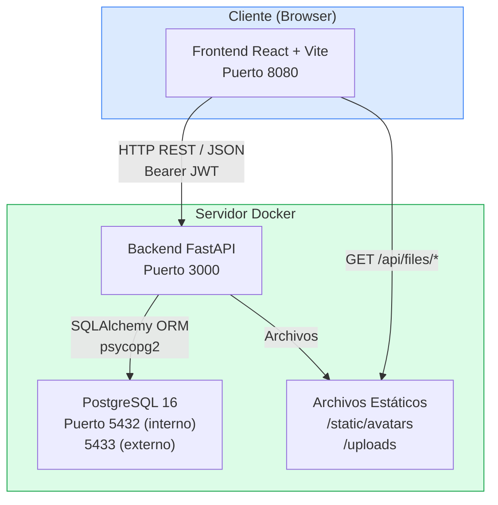

### Comunicación entre capas

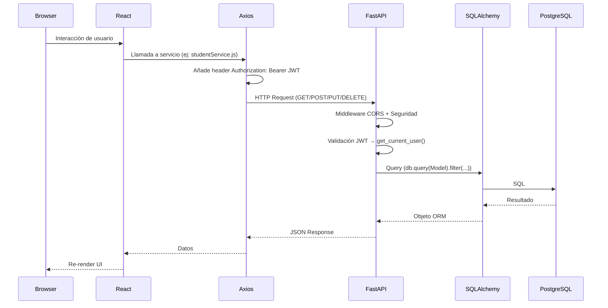

---

## 4. Estructura del Proyecto

```
Test_math/
├── Backend/                        # API REST en Python/FastAPI
│   ├── app/
│   │   ├── main.py                 # Punto de entrada, middlewares, rutas
│   │   ├── config.py               # Variables de entorno (Pydantic Settings)
│   │   ├── database.py             # Conexión SQLAlchemy a PostgreSQL
│   │   ├── models.py               # Modelos ORM (15 tablas)
│   │   ├── schemas.py              # Esquemas Pydantic (validación entrada/salida)
│   │   ├── auth.py                 # JWT, bcrypt, middleware de roles
│   │   ├── exercise_generator.py   # Generador dinámico de ejercicios
│   │   ├── ai_recommendations.py   # Recomendaciones de ejercicios
│   │   ├── routers/
│   │   │   ├── auth.py             # /api/auth — login, logout, perfil
│   │   │   ├── users.py            # /api/users — CRUD usuarios (admin)
│   │   │   ├── paralelos.py        # /api/paralelos — CRUD paralelos (admin)
│   │   │   ├── teacher.py          # /api/teacher — funciones de profesor
│   │   │   ├── student.py          # /api/student — juego y progreso
│   │   │   ├── badges.py           # /api/badges — insignias
│   │   │   └── settings.py         # /api/settings — config del sistema
│   │   └── services/
│   │       └── email_service.py    # Envío de emails SMTP (Gmail)
│   ├── requirements.txt
│   ├── Dockerfile
│   ├── create_admin.py             # Script: crear usuario admin inicial
│   ├── create_badges.py            # Script: cargar insignias iniciales
│   ├── create_settings.py          # Script: cargar configuración inicial
│   └── reset_passwords.py          # Script: resetear contraseñas
│
├── Frontend/                       # SPA en React + Vite
│   ├── src/
│   │   ├── App.jsx                 # Raíz: Router, Providers, Rutas
│   │   ├── context/
│   │   │   ├── AuthContext.jsx     # Estado global de autenticación
│   │   │   └── SettingsContext.jsx # Configuración global del sistema
│   │   ├── services/
│   │   │   ├── api.js              # Instancia Axios + interceptor JWT
│   │   │   ├── authService.js      # login, logout, perfil, cambio de contraseña
│   │   │   ├── studentService.js   # dashboard, juego, progreso, ranking
│   │   │   ├── teacherService.js   # paralelos, metas, competencias, reportes
│   │   │   ├── paraleloService.js  # CRUD paralelos
│   │   │   ├── userService.js      # CRUD usuarios
│   │   │   ├── badgeService.js     # insignias
│   │   │   ├── resourceService.js  # recursos educativos
│   │   │   └── settingService.js   # configuración del sistema
│   │   ├── components/
│   │   │   ├── layout/
│   │   │   │   ├── AdminLayout.jsx
│   │   │   │   ├── TeacherLayout.jsx
│   │   │   │   └── StudentLayout.jsx
│   │   │   └── modals/             # Componentes modales reutilizables
│   │   └── pages/
│   │       ├── Login.jsx
│   │       ├── ForgotPassword.jsx
│   │       ├── Profile.jsx
│   │       ├── AboutUs.jsx
│   │       ├── admin/
│   │       │   ├── Dashboard.jsx
│   │       │   ├── Users.jsx
│   │       │   ├── Paralelos.jsx
│   │       │   └── Settings.jsx
│   │       ├── teacher/
│   │       │   ├── Dashboard.jsx
│   │       │   ├── MyParalelos.jsx
│   │       │   ├── ParaleloStudents.jsx
│   │       │   ├── StudentDetail.jsx
│   │       │   ├── Goals.jsx
│   │       │   ├── Versus.jsx
│   │       │   ├── TeacherRanking.jsx
│   │       │   ├── Resources.jsx
│   │       │   ├── Performance.jsx
│   │       │   ├── Reports.jsx
│   │       │   └── Badges.jsx
│   │       └── student/
│   │           ├── Dashboard.jsx
│   │           ├── Game.jsx
│   │           ├── Ranking.jsx
│   │           ├── Goals.jsx
│   │           ├── Challenges.jsx
│   │           ├── Badges.jsx
│   │           └── Resources.jsx
│   ├── package.json
│   ├── vite.config.js
│   └── Dockerfile
│
├── docker-compose.yml              # Orquestación de los 3 servicios
├── .env.example                    # Plantilla de variables de entorno
├── DOCUMENTO_TECNICO.md            # Este documento
└── COMO_PROBAR.md                  # Guía de pruebas
```

---

## 5. Base de Datos — Modelo de Datos

### Diagrama Entidad-Relación

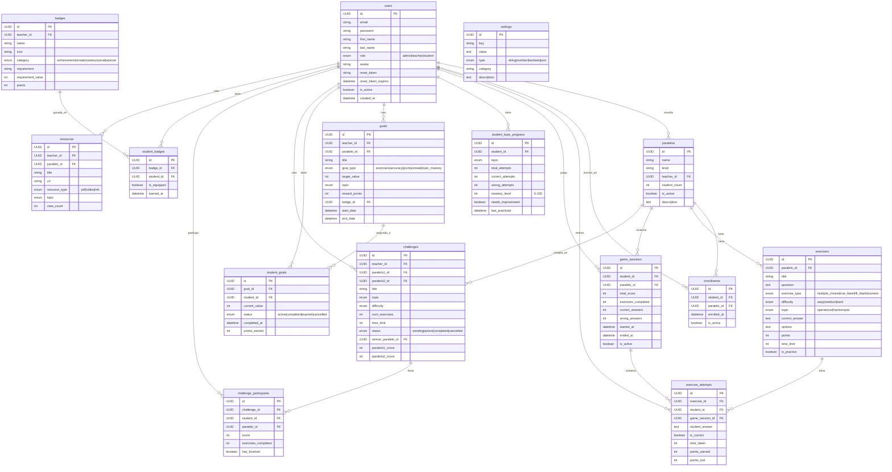

### Descripción de cada tabla

| Tabla | Descripción |
|-------|-------------|
| `users` | Todos los usuarios del sistema con su rol (admin/teacher/student) |
| `paralelos` | Clases/grupos escolares asignados a un profesor |
| `enrollments` | Relación muchos-a-muchos entre estudiantes y paralelos |
| `exercises` | Ejercicios matemáticos (pueden ser creados por profesor o generados dinámicamente) |
| `exercise_attempts` | Registro de cada intento de un estudiante en un ejercicio |
| `game_sessions` | Sesión de juego de un estudiante (agrupa múltiples intentos) |
| `student_topic_progress` | Progreso de dominio de cada tema matemático por estudiante |
| `goals` | Metas educativas creadas por el profesor |
| `student_goals` | Asignación y seguimiento de metas por estudiante |
| `challenges` | Competencias entre dos paralelos |
| `challenge_participants` | Participación individual de estudiantes en competencias |
| `badges` | Catálogo de insignias (sistema o creadas por profesor) |
| `student_badges` | Insignias ganadas por cada estudiante |
| `resources` | Material educativo (PDF, video, enlace) |
| `settings` | Configuración global del sistema (clave-valor) |

---

## 6. Backend — API FastAPI

### Punto de entrada: `Backend/app/main.py`

Este archivo:
1. Crea la instancia de FastAPI con título, versión y configuración de Swagger
2. Configura middleware CORS (permisivo en desarrollo, restrictivo en producción)
3. Agrega headers de seguridad HTTP en cada respuesta
4. Habilita rate limiting solo en producción (100 req / 15 min por IP)
5. Registra todos los routers bajo el prefijo `/api/...`
6. Monta archivos estáticos en `/static` y `/api/files`

### Mapa de Endpoints

```mermaid
graph LR
    API["/api"]

    API --> AUTH["/auth"]
    AUTH --> A1["POST /login"]
    AUTH --> A2["POST /logout"]
    AUTH --> A3["GET /me"]
    AUTH --> A4["POST /forgot-password"]
    AUTH --> A5["POST /reset-password"]
    AUTH --> A6["POST /change-password"]
    AUTH --> A7["PUT /profile"]
    AUTH --> A8["POST /upload-avatar"]
    AUTH --> A9["DELETE /avatar"]

    API --> USERS["/users ⚙️ admin"]
    USERS --> U1["GET / — Listar usuarios"]
    USERS --> U2["POST / — Crear usuario"]
    USERS --> U3["GET /{id}"]
    USERS --> U4["PUT /{id}"]
    USERS --> U5["DELETE /{id}"]
    USERS --> U6["GET /stats"]

    API --> PAR["/paralelos ⚙️ admin"]
    PAR --> P1["GET / — Listar"]
    PAR --> P2["POST / — Crear"]
    PAR --> P3["GET /{id}"]
    PAR --> P4["PUT /{id}"]
    PAR --> P5["DELETE /{id}"]
    PAR --> P6["POST /{id}/assign-students"]
    PAR --> P7["GET /{id}/students"]

    API --> TEACH["/teacher 🎓 teacher"]
    TEACH --> T1["GET /my-paralelos"]
    TEACH --> T2["GET /paralelo/{id}/students"]
    TEACH --> T3["GET /student/{id}/progress"]
    TEACH --> T4["POST/PUT/DELETE /goals"]
    TEACH --> T5["POST/GET/PUT /challenges"]
    TEACH --> T6["POST /exercise"]
    TEACH --> T7["GET /performance"]
    TEACH --> T8["POST /generate-report"]

    API --> STU["/student 🎮 student"]
    STU --> S1["GET /dashboard"]
    STU --> S2["POST /start-game"]
    STU --> S3["POST /submit-answer"]
    STU --> S4["GET /game-session/{id}"]
    STU --> S5["POST /end-game"]
    STU --> S6["GET /my-progress"]
    STU --> S7["GET /my-goals"]
    STU --> S8["GET /topic-progress"]
    STU --> S9["GET /badges"]
    STU --> S10["GET /ranking"]

    API --> BADG["/badges"]
    API --> SET["/settings ⚙️ admin"]
```

### Archivos del Backend y su responsabilidad

| Archivo | Responsabilidad |
|---------|----------------|
| `main.py` | Punto de entrada, middlewares, montaje de rutas |
| `config.py` | Lee variables de entorno usando Pydantic Settings |
| `database.py` | Crea engine SQLAlchemy, session factory, `get_db()` dependency |
| `models.py` | Define las 15 tablas con sus relaciones ORM |
| `schemas.py` | Define los esquemas Pydantic para request/response de cada endpoint |
| `auth.py` | `verify_password`, `get_password_hash`, `create_access_token`, `get_current_user`, `require_role` |
| `exercise_generator.py` | Clase `ExerciseGenerator` — genera ejercicios dinámicamente por tema y dificultad |
| `ai_recommendations.py` | Lógica de recomendaciones basada en historial del estudiante |
| `routers/auth.py` | Endpoints de autenticación y gestión de perfil |
| `routers/users.py` | CRUD completo de usuarios (solo admin) |
| `routers/paralelos.py` | CRUD de paralelos, asignación de estudiantes |
| `routers/teacher.py` | Toda la funcionalidad del rol profesor |
| `routers/student.py` | Toda la funcionalidad del rol estudiante (juego, progreso) |
| `routers/badges.py` | CRUD de insignias |
| `routers/settings.py` | Configuración del sistema |
| `services/email_service.py` | Envío de emails vía SMTP (Gmail) para recuperación de contraseña |

---

## 7. Frontend — React

### Contextos globales

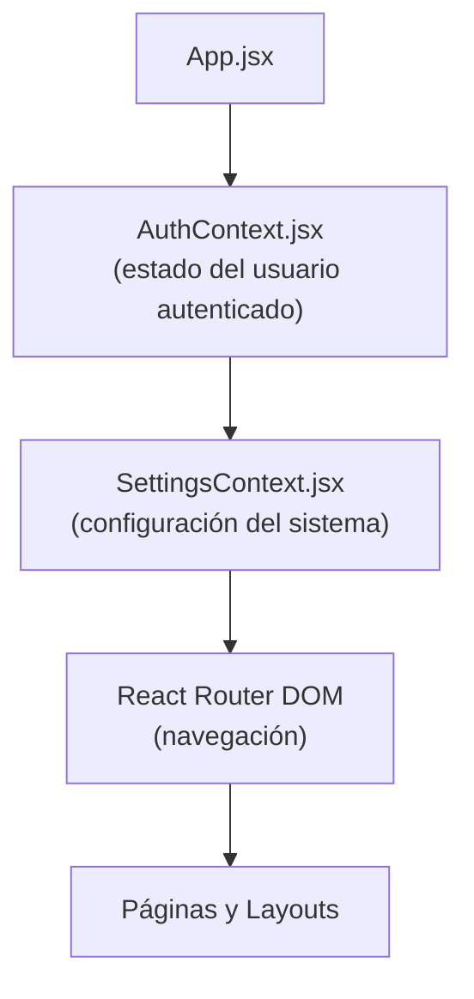

**`AuthContext.jsx`** — Mantiene:
- El usuario actual (`user`)
- El token JWT
- Funciones: `login()`, `logout()`, `updateUser()`
- Persiste en `localStorage`

**`SettingsContext.jsx`** — Mantiene:
- Configuración general del sistema (obtenida del API `/api/settings`)
- Nombre de la plataforma, colores, etc.

### Servicios del Frontend (`src/services/`)

Todos los servicios importan la instancia de Axios (`api.js`) que ya incluye el token JWT en cada petición.

| Servicio | Endpoints que consume |
|---------|----------------------|
| `authService.js` | `/api/auth/*` |
| `studentService.js` | `/api/student/*` |
| `teacherService.js` | `/api/teacher/*` |
| `paraleloService.js` | `/api/paralelos/*` |
| `userService.js` | `/api/users/*` |
| `badgeService.js` | `/api/badges/*` |
| `resourceService.js` | `/api/teacher/resources/*` |
| `settingService.js` | `/api/settings/*` |

### Rutas del Frontend

```mermaid
graph TD
    ROOT["/"]
    LOGIN["/login"]
    FORGOT["/forgot-password"]

    ROOT --> LOGIN

    ADMIN["/admin/*<br/>AdminLayout"]
    ADMIN --> AD["/admin/dashboard"]
    ADMIN --> AU["/admin/users"]
    ADMIN --> AP["/admin/paralelos"]
    ADMIN --> AS["/admin/settings"]

    TEACHER["/teacher/*<br/>TeacherLayout"]
    TEACHER --> TD["/teacher/dashboard"]
    TEACHER --> TM["/teacher/paralelos"]
    TEACHER --> TS["/teacher/paralelo/:id/students"]
    TEACHER --> TSD["/teacher/student/:id"]
    TEACHER --> TG["/teacher/goals"]
    TEACHER --> TV["/teacher/versus"]
    TEACHER --> TR["/teacher/ranking"]
    TEACHER --> TRE["/teacher/resources"]
    TEACHER --> TP["/teacher/performance"]
    TEACHER --> TRP["/teacher/reports"]
    TEACHER --> TB["/teacher/badges"]

    STUDENT["/student/*<br/>StudentLayout"]
    STUDENT --> SGD["/student/dashboard"]
    STUDENT --> SGG["/student/game"]
    STUDENT --> SGR["/student/ranking"]
    STUDENT --> SGO["/student/goals"]
    STUDENT --> SGC["/student/challenges"]
    STUDENT --> SGB["/student/badges"]
    STUDENT --> SGRS["/student/resources"]
```

### Layouts por rol

Cada rol tiene su propio layout wrapper que:
- Verifica que el usuario esté autenticado y tenga el rol correcto
- Renderiza la barra de navegación lateral específica del rol
- Renderiza la página activa dentro del `<Outlet />`

---

## 8. Sistema de Autenticación y Roles

### Flujo de autenticación

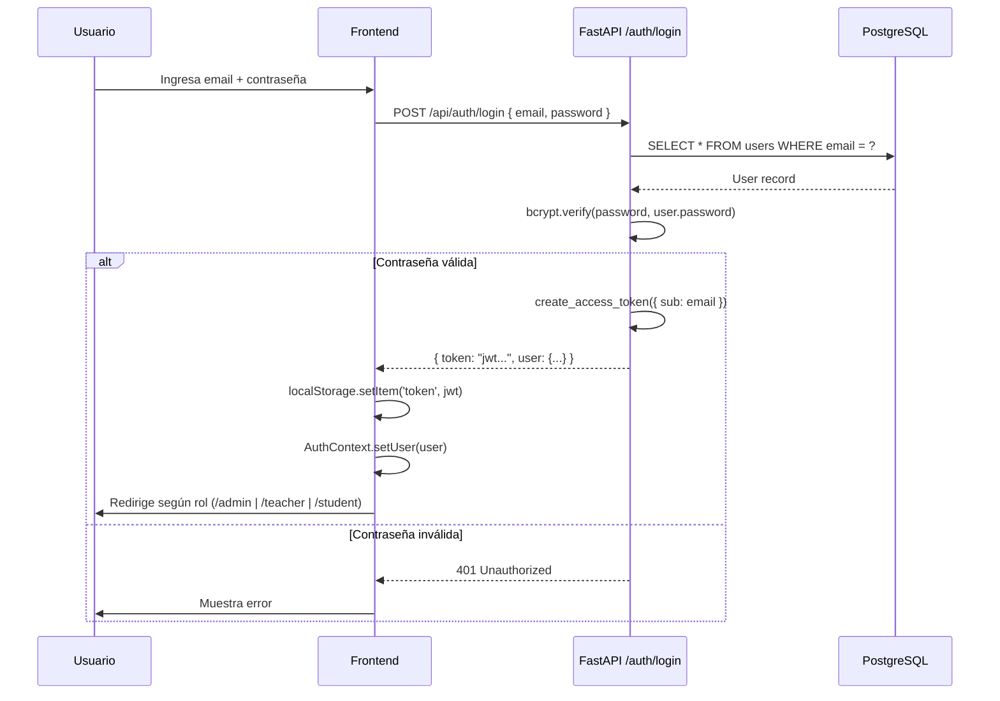

### Protección de endpoints en el backend

```python
# auth.py — Middleware de roles
def require_role(required_role: UserRole):
    def role_checker(current_user: User = Depends(get_current_user)) -> User:
        if current_user.role != required_role and current_user.role != UserRole.admin:
            raise HTTPException(403, "No tienes permisos")
        return current_user
    return role_checker
```

El rol `admin` tiene acceso a todos los endpoints. El rol `teacher` solo accede a `/api/teacher/*` y el rol `student` solo a `/api/student/*`.

### Token JWT

- **Algoritmo:** HS256
- **Expiración:** 7 días (configurable con `JWT_EXPIRES_IN`)
- **Payload:** `{ sub: email, exp: timestamp }`
- **Reset de contraseña:** Token separado con expiración de 1 hora

---

## 9. Lógica de Negocio Principal

### 9.1 Generador de Ejercicios (`exercise_generator.py`)

La clase `ExerciseGenerator` genera ejercicios matemáticos en tiempo de ejecución sin necesitar almacenarlos en la base de datos.

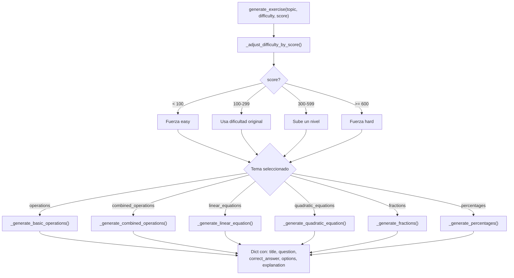

**Temas matemáticos disponibles:**

| Tema | Descripción |
|------|-------------|
| `operations` | Operaciones básicas: +, -, ×, ÷ |
| `combined_operations` | Operaciones con múltiples pasos y paréntesis |
| `linear_equations` | Ecuaciones lineales (ax + b = c, etc.) |
| `quadratic_equations` | Ecuaciones cuadráticas (x² + bx + c = 0) |
| `fractions` | Suma, multiplicación y división de fracciones |
| `percentages` | Cálculo de porcentajes |

### 9.2 Sistema de Puntuación

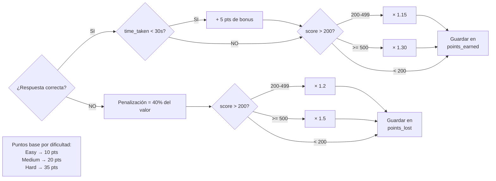

### 9.3 Flujo de una sesión de juego del estudiante

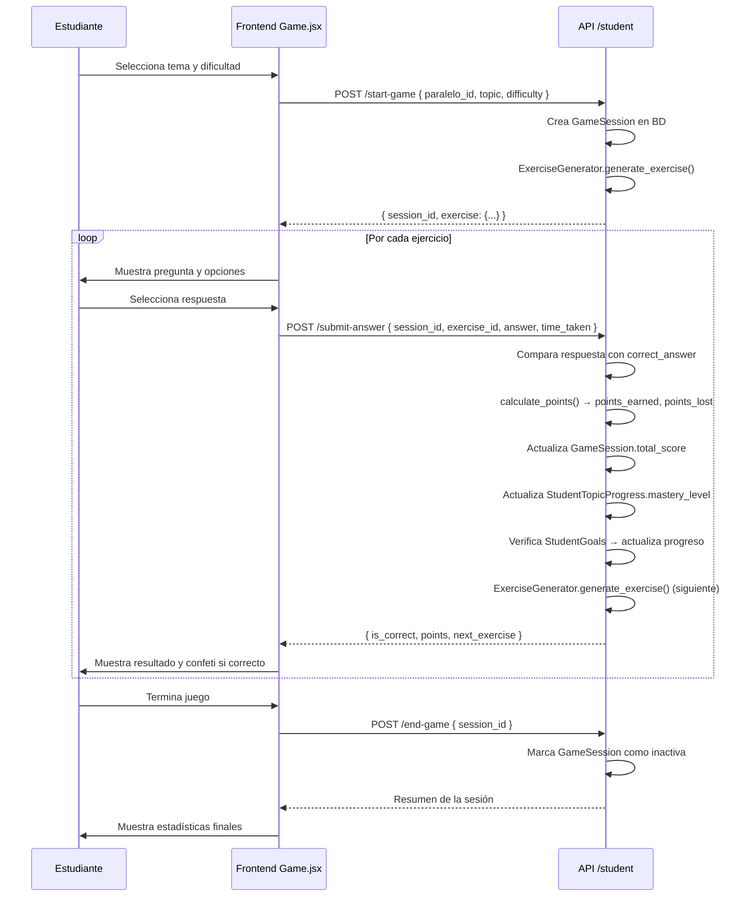

### 9.4 Sistema de Metas (Goals)

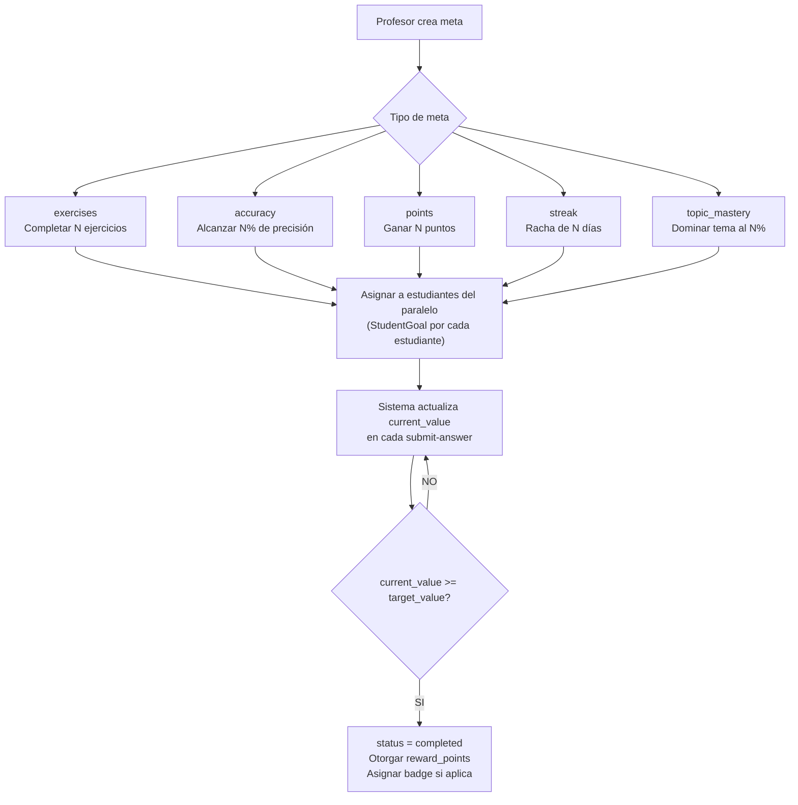

### 9.5 Sistema de Competencias (Versus)

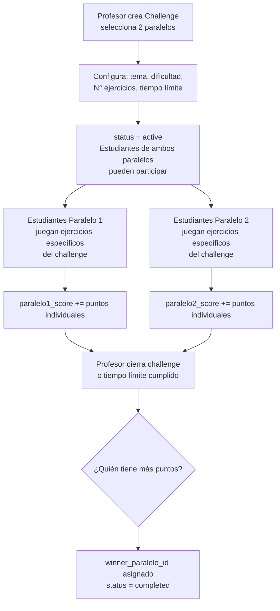

### 9.6 Seguimiento de Progreso por Tema

Cada vez que un estudiante responde un ejercicio, el backend actualiza `StudentTopicProgress`:

```python
mastery_level = (correct_attempts / total_attempts) * 100  # 0-100
needs_improvement = mastery_level < 50
```

Esto permite al profesor ver en la vista de rendimiento qué temas necesitan refuerzo para cada estudiante.

---

## 10. Infraestructura y Despliegue

### Docker Compose — 3 servicios

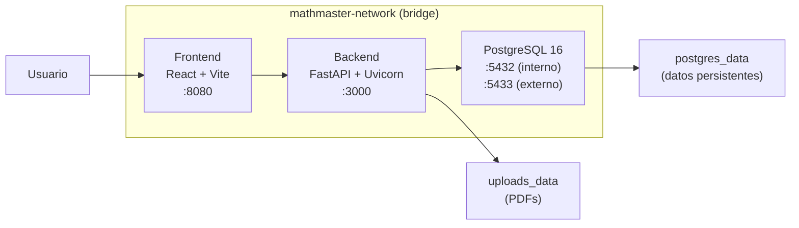

### Servicios Docker

| Servicio | Container | Puerto | Imagen |
|----------|-----------|--------|--------|
| `db` | `mathmaster-db` | 5433:5432 | postgres:16-alpine |
| `backend` | `mathmaster-backend` | 3000:3000 | Python 3 (Dockerfile) |
| `frontend` | `mathmaster-frontend` | 8080:8080 | Node (Dockerfile) |

### Health Checks

Todos los servicios tienen health checks configurados:
- **DB:** `pg_isready -U mathmaster` (cada 10s)
- **Backend:** Llama a `http://localhost:3000/health` (cada 30s)
- **Frontend:** Llama a `http://localhost:8080/health` (cada 30s)

El backend espera a que la DB esté healthy antes de iniciarse (`depends_on: condition: service_healthy`).

### URLs de acceso (desarrollo local)

| Servicio | URL |
|---------|-----|
| Frontend | http://localhost:8080 |
| Backend API | http://localhost:3000 |
| Swagger UI | http://localhost:3000/docs |
| Health Check | http://localhost:3000/health |
| PostgreSQL | localhost:5433 |

### Producción (Railway)

- Frontend: `https://steadfast-generosity-production.up.railway.app`
- El Swagger UI se desactiva en producción (`docs_url=None`)
- CORS solo permite orígenes configurados
- Rate limiting activo

---

## 11. Variables de Entorno

### Backend (`.env`)

| Variable | Descripción | Ejemplo |
|----------|-------------|---------|
| `DB_HOST` | Host de PostgreSQL | `db` (Docker) / `localhost` |
| `DB_PORT` | Puerto de PostgreSQL | `5432` |
| `DB_NAME` | Nombre de la BD | `mathmaster_db` |
| `DB_USER` | Usuario de la BD | `mathmaster` |
| `DB_PASSWORD` | Contraseña de la BD | `mathmaster123` |
| `JWT_SECRET` | Clave secreta para firmar JWT | clave larga y segura |
| `JWT_ALGORITHM` | Algoritmo JWT | `HS256` |
| `JWT_EXPIRES_IN` | Días de expiración del token | `7` |
| `PORT` | Puerto del servidor | `3000` |
| `NODE_ENV` | Entorno | `development` / `production` |
| `CORS_ORIGINS` | Orígenes permitidos | `http://localhost:8080,...` |
| `SMTP_HOST` | Servidor de correo | `smtp.gmail.com` |
| `SMTP_PORT` | Puerto SMTP | `587` |
| `SMTP_USER` | Cuenta de correo | `tu@gmail.com` |
| `SMTP_PASSWORD` | Contraseña de aplicación | generada en Google |
| `FRONTEND_URL` | URL del frontend (para emails) | `http://localhost:8080` |

### Frontend (`.env` / variables Vite)

| Variable | Descripción | Ejemplo |
|----------|-------------|---------|
| `VITE_API_URL` | URL base de la API | `http://localhost:3000/api` |

---

## 12. Credenciales por Defecto

> **Nota:** Estas credenciales se crean mediante los scripts de inicialización (`create_admin.py`).

| Rol | Email | Contraseña |
|-----|-------|-----------|
| Admin | `admin@mathmaster.com` | `Admin123!` |
| Profesor | `docente@mathmaster.com` | `Docente123!` |
| Estudiante 1 | `estudiante@mathmaster.com` | `Estudiante123!` |
| Estudiante 2-5 | `estudiante2-5@mathmaster.com` | `Estudiante123!` |

---

## 13. Flujos Principales del Sistema

### Flujo completo de un nuevo usuario

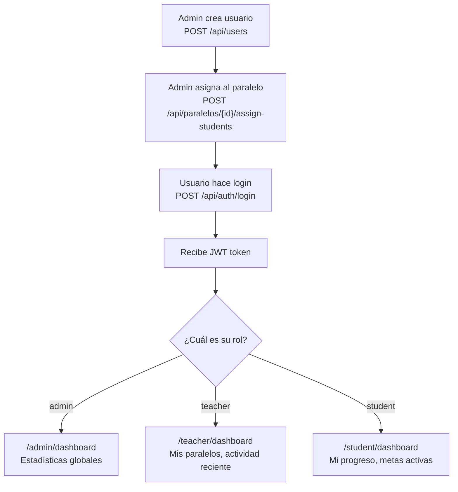

### Flujo de recuperación de contraseña

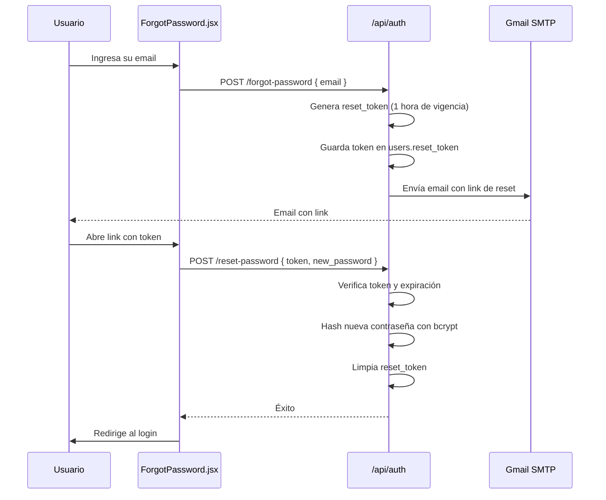

### Flujo de creación de una competencia (Versus)

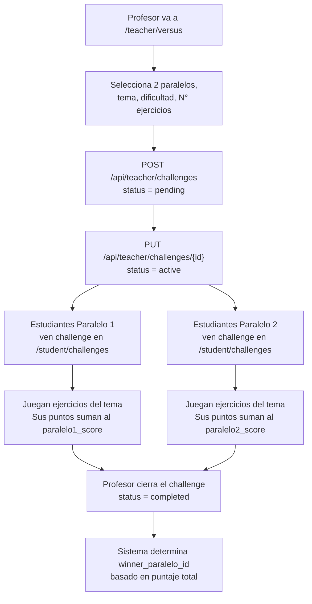

---

## Apéndice: Scripts de inicialización

El proyecto incluye scripts Python para poblar datos iniciales:

| Script | Función |
|--------|---------|
| `create_admin.py` | Crea el usuario administrador inicial |
| `create_badges.py` | Carga el catálogo base de insignias del sistema |
| `create_settings.py` | Carga la configuración inicial del sistema |
| `reset_passwords.py` | Resetea contraseñas de usuarios de prueba |

Estos scripts se ejecutan directamente con Python dentro del contenedor del backend:

```bash
docker exec -it mathmaster-backend python create_admin.py
docker exec -it mathmaster-backend python create_badges.py
docker exec -it mathmaster-backend python create_settings.py
```

---

*Documento generado para el proyecto MathMaster v2.0.0 — Marzo 2026*
